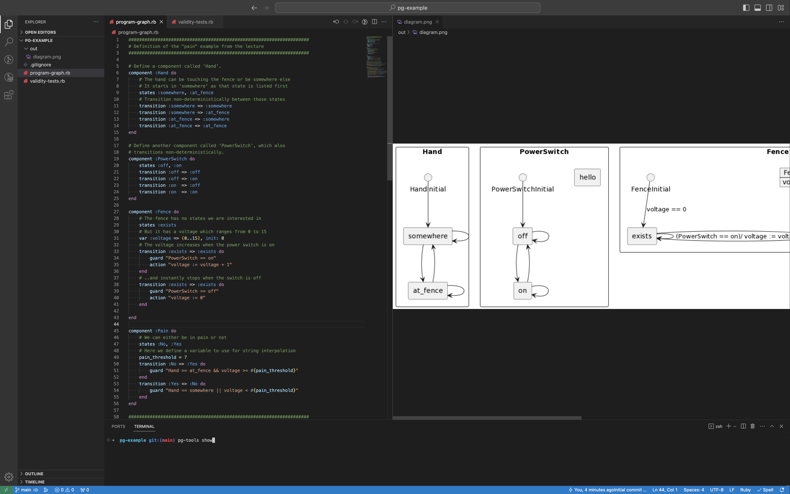
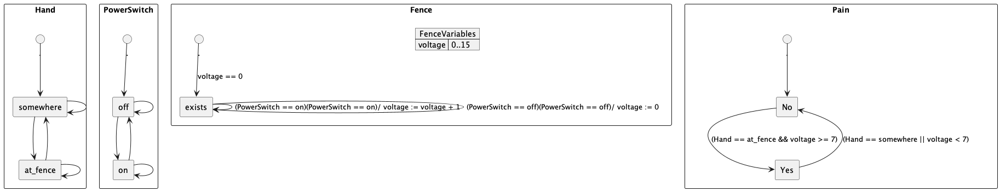
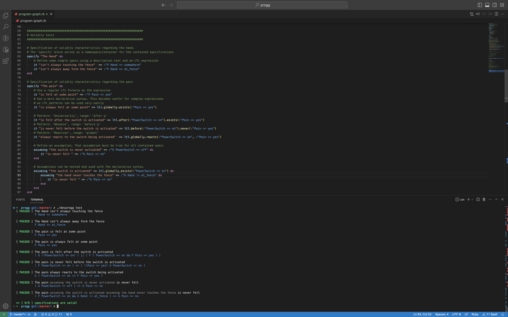

# PG-Tools

PG-Tools ist ein textbasiertes CLI-Programm zur Entwicklung und Einbindung von
Programmgraphen im Kontext der formalen Sicherheitsanalyse.

Ziel ist es, ein anwenderfreundliches, robustes und zukunftssicheres System zu entwickeln,
das möglichst im Hintergrund bleibt und Platz für das Wesentliche lässt: Das Modellieren.

## Beispielprojekt

Damit klarer wird, welches System wir uns vorstellen, demonstrieren wir im Folgenden ein kleines
Beispielprojekt. Es handelt sich um eine leicht modifizierte Version 
des "Weidezaun"-Projektes aus der Vorlesung.
Die Ausgaben sind teilweise noch von Hand erstellt, da die Implementierung noch
nicht weit genug fortgeschritten ist.
Die beschriebene Funktionalität dient natürlich erstmal als Gesprächsgrundlage.

### Die Entwicklungsumgebung

Da wir vorhaben, ein CLI-Programm zu erstellen, das mit "Plain Text" arbeitet,
ist jede Entwicklungsumgebung denkbar.
Das folgende Bild zeigt also nur ein Beispiel.
(Mehr dazu [hier](#warum-cli-und-plain-text))



Links im Bild sieht man die Definition eines Programmgraphen über die
Ruby DSL. Rechts sieht man die generierte Grafik. Die Grafik wird aktualisiert sobald
man `pg-tools show` ausführt, so wie unten abgebildet.

### Das Weidezaun-Beispiel in der Ruby DSL

Zur besseren Lesbarkeit folgt das Weidezaun-Beispiel in der Ruby DSL:

```ruby
model :FarmFence do
    # Define a component called 'Hand'.
    graph :Hand do
        # The hand can be touching the fence or be somewhere else
        # It starts in 'somewhere' as that state is listed first
        states :somewhere, :at_fence

        # Transition non-deterministically between those states
        transition :somewhere => :somewhere
        transition :somewhere => :at_fence
        transition :at_fence => :somewhere
        transition :at_fence => :at_fence
    end

    # Define another component called 'PowerSwitch', which also
    # transitions non-deterministically.
    graph :PowerSwitch do
        states :off, :on
        transition :off => :off
        transition :off => :on
        transition :on  => :off
        transition :on  => :on
    end

    graph :Fence do
        # The fence has no states we are interested in
        states :exists

        # The fence has a voltage which can go up to 15
        var :voltage => (0..15), init: 0

        # The voltage increases when the power switch is on
        transition :exists => :exists do
            guard "PowerSwitch == on"
            action "voltage := voltage + 1"
        end
        # ..and instantly stops when the switch is off
        transition :exists => :exists do
            guard "PowerSwitch == off"
            action "voltage := 0"
        end

    end

    graph :Pain do
        # We can either be in pain or not
        states :No, :Yes
        # Using regular variables with string interpolation
        pain_threshold = 7
        transition :No => :Yes do
            guard "Hand == at_fence && voltage >= #{pain_threshold}"
        end
        transition :Yes => :No do
            guard "Hand == somewhere || voltage < #{pain_threshold}"
        end
    end
end
```

Und hier die generierte Grafik:



### Validitätsprüfungen



Oben im Bild ist die Definition von Spezifikationen zur Validitätsprüfung dargestellt.
Führt man `pg-tools test` aus, erhält man die unten dargestellte Ausgabe.
(Das Feature ist noch nicht implementiert. Tatsächlich wären hier einige Tests fehlgeschlagen.)
Die Syntax ist vom beliebten Test-Framework [Rspec](https://rspec.info/) inspiriert. 
Im Fehlerfall würde der Ablauf ausgegeben, der die Formel verletzt.

Nach der Fehlerintegration könnte man Fehler beispielsweise so ausschließen:

```ruby
BEP = 150
errors = [ :BreaksError, :SensorError ]
# ...
no_errors = errors.map { |error| "G #{error} == no" }.join(" && ")
specify "The train" do
    assuming "there are no errors" => no_errors do
        it "reaches BEP" => :"G Tain.position > #{BEP}"
    end
end
```

Zudem kann man die Ruby DSL so erweitern, dass Fehlerautomaten
im internen Datenmodell von gewöhnlichen Komponenten unterschieden werden können.
Damit kann man eine knappe Syntax anbieten und die DCCA vollautomatisch durchführen:

```ruby
# Erzeugt Fehlerautomaten für die Bremse & den Zugsensor
persistent error :Breaks
transient error :Sensor

# Validität unter Ausschluss von Fehlern
# 'no_erros' kann hier automatisch generiert werden
specify "The train" do
    assuming "there are no errors" => no_errors do
        it "reaches BEP" => :"G Tain.position > #{BEP}"
    end
end

# Definition einer Gefährdung für die DCCA. Ausführbar mit: 'pg-tools dcca'
hazard "Train on unsecured railroad crossing" \
    => :"Barrier.angle > #{barrier_closed_angle} && Train.position >= #{train_pos_gep} && Train.position <= #{tain_pos_sp}"
```

### Validitätsprüfungen in der Ruby DSL

Zur besseren Lesbarkeit ist hier nochmal die Spezifikation der
Validitätsprüfungen für das Weidezaun-Beispiel in der Ruby DSL:

```ruby
# Specification of validity characteristics regarding the hand.
# The 'specify' block serves as a namespace/container for the contained specifications
specify "The Hand" do
    # Define some simple specs using a description text and an LTL expression
    it "isn't always touching the fence"  => :"F Hand == somewhere"
    it "isn't always away form the fence" => :"F Hand == at_fence"
end

# Specification of validity characteristics regarding the pain
specify "The pain" do
    # Use a regular LTL Formula as the expression
    it "is felt at some point" => :"F Pain == yes"
    # Use a more declarative syntax. This becomes useful for complex expressions
    # as LTL patterns can be used very easily
    it "is always felt at some point" => ltl.globally.exists(:"Pain == yes")

    # Pattern: 'Universality', range: 'after q'
    it "is felt after the switch is activated" => ltl.after(:"PowerSwitch == on").exists(:"Pain == yes")
    # Pattern: 'Absence', range: 'before q'
    it "is never felt before the switch is activated" => ltl.before(:"PowerSwitch == on").never(:"Pain == yes")
    # Pattern: 'Reaction', range: 'global'
    it "always reacts to the switch being activated"  => ltl.globally.reacts(:"PowerSwitch == on", :"Pain == yes")

    # Define an assumption. That assumption must be true for all contained specs
    assuming "the switch is never activated" => :"G PowerSwitch == off" do
        it "is never felt " => :"G Pain == no"
    end

    # Assumptions can be nested and used with the declarative syntax.
    assuming "the switch is activated" => ltl.globally.exists(:"PowerSwitch == on") do
        assuming "the hand never touches the fence" => :"G Hand != at_fence" do
            it "is never felt " => :"G Pain == no"
        end
    end
end
```

## Eingabesprachen

Die bisherigen Beispiele wurden in der Ruby DSL verfasst.
Wir planen aber zusätzlich eine eigene Eingabesprache anzubieten, die mit
einem language server integriert ist (mehr dazu [hier](#language-server)).

Es folgt eine Gegenüberstelung von verschiedenen Möglichkeiten für eine solche 
Eingabesprache. Das resultierende Modell wäre in allen Fällen identisch.

In der Ruby DSL:

```ruby
model :FarmFence do

    graph :Fence do
        states :exists

        var voltage: (0..15), init "voltage >= 1 && voltage <= 5"

        transition :exists => :exists {
            guard  "PowerSwitch == on"
            action "voltage := voltage + 1"
        }
        transition :exists => :exists {
            guard  "PowerSwitch == on"
            action "voltage := voltage + 1"
        }
    end

end
```

Von Ruby und Json inspiererte Möglichkeit für eine Eingabesprache:

```
model FarmFence {

    graph Fence (exists) {
        var voltage (0..15) : voltage >= 1 && voltage <= 5

        transition exists => exists {
            PowerSwitch == on / voltage := voltage + 1
        }
        transition exists => exists {
            PowerSwitch == off / voltage := voltage + 1
        }
    }
}
```

Von Python und Yaml inspiererte Möglichkeit für eine Eingabesprache:

```
model FarmFence:

    graph Fence { exists }:
        var voltage (0..15) init voltage >= 1 && voltage <= 5

        transition exists => exists: 
            PowerSwitch == on / voltage := voltage + 1

        transition exists => exists: 
            PowerSwitch == off / voltage := 0

```


## Language Server

Language Servers ermöglichen es, effizient Sprach-Features zu implementieren. Dazu gehören zum Beispiel:
- Code-Vervollständigung
- Fehler-Überprüfung und -diagnose
- Springen zur Definition einer Funktion

Wir möchten versuchen, pg-tools in einen Language Server zu integrieren. Allerdings wissen wir mangels eigener Erfahrung nicht, ob das mit angemessenem Aufwand möglich ist und können deshalb nicht versprechen, dass dieses Fearture am Ende im Produkt enthalten sein wird.

Durch diese Integration möchten wir den Entwickler:innen ermöglichen:
- Sich auf die Modellierung der Graphen zu konzentrieren, anstatt wieder und wieder die gleiche Variable auszuschreiben
- Sofort zu sehen, was falsch ist, anstatt stundenlang selbst nach Fehlern zu suchen
- Somit möglichst produktiv zu arbeiten

Weitere große Vorteile der Verwendung eines Language Servers sind Wiederverwendbarkeit und Plattformunabhängigkeit.
Wiederverwendbarkeit wird dadurch erreicht, dass man die Sprach-Features nur einmal definieren muss
und diese dann über wohldefinierte Schnittstellen vom Client aus aufrufen kann.
Plattformunabhängigkeit wird dadurch erreicht, dass man Language Clients in jedem erdenklichen Text-Editor bzw. IDE implementieren kann.
Beispielhaft soll ein Language Client für Visual Studio Code implementiert werden.
Dieser Editor ist für alle großen Betriebssysteme - Linux, Mac und Windows verfügbar.
Durch die angesprochene Plattformunabhängigkeit wollen wir einen Mehrwert gegenüber dem
aktuell verwendeten Produkt schaffen, welches nur auf Windows über MS VisualStudio verwendet werden kann.

Zudem ist es wahrscheinlich möglich, die oben angesprochenen Validitätsüberprüfungen direkt
über den Language Server abzufragen und in Echtzeit zur Verfügung zu stellen.

# Features

Im Folgenden haben wir einige Ideen für Features aufgelistet:

- Einlesen von Modellen über Ruby DSL, JSON und YAML
- Einlesen einer eigenen Eingabesprache mit Unterschützung durch einen Language Server
- Ausgeben von Modellen in JSON, YAML, PlantUML
- Integration von NuSMV, Prism und ggf. weiterer Model Checker.
- Simulation von Modellen und Ausgabe als Video oder GIF
- Integriertes Test-Framework zur Validitätsprüfung
- Deklarative Syntax zur Verwendung der "LTL-Pattern" aus der Vorlesung
- Automatische DCCA
- Installation über ein Kommando (`gem install pg-tools`)
- Einfache Einarbeitung (mit Kommando `pg-tools init`)
    - Hier wird ein Beispielprojekt angelegt um die Projektstruktur vorzugeben
- Ansprechende Dokumentation
- Konfigurationsmöglichkeiten  
- Hilfreiche Fehlermeldungen
- Unterstützung eines Language Servers
- Implementierung eines Language Clients für Visual Studio Code

# Warum CLI und Plain Text

Das Verständnis eines Systems ist zwar die Grundlage der Modellierung, aber nur ihr Anfang.
Erst durch die Konzeptualisierung ist es möglich, Modelle festzuhalten, zu kommunizieren, 
Denkfehler aufzudecken und sie maschinell zu verarbeiten.

Mit den folgenden Argumenten wollen wir darstellen, warum die Verwendung von "Plain Text" und eines CLI-Programms
für die Konzeptualisierung bzw. Festschreibung von Modellen besser geeignet ist als eine graphische Lösung.
(Mit "Pain Text" meinen wir den Ansatz, dass alle Projektdateien ausschließlich Text enthaten,
der schon für sich und ohne die Verwendung von Tools verständlich ist)

## Unkomplizierte Eingabe

Graphische Darstellungen sind sehr nützlich, um Modelle zu verstehen.
Dabei liegt ihr Vorteil aber in der effizienten *Aufnahme* von Informationen,
durch den Betrachter.

Bei der *Ausgabe* der eignenen Gedanken können graphische Editoren oft hinderlich sein.
Nebensächlichkeiten, wie das Layout und eine umständliche Navigation im UI
stehen dem eigentlichen Ziel - der Modellierung - eher im Weg.

Wir wollen die Verständlichkeit einer graphischen Ausgabe
mit der unkomplizierten Eingabe über Text verbinden.

## Einfache Zusammenarbeit

Tools wie Git(-Hub) sind auf die Verarbeitung von Text ausgelegt.
Versionskontrolle, Code Reviews und das Beheben von Merge-Konflikten
funktionieren deutlich besser mit "Plain Text".

## Zeitlosigkeit & Technologie-Unabhängigkeit

Die Wartung und Instandhaltung von UI-basierten Programmen ist nur mit großem Aufwand möglich.
Bibliotheken veralten und Design Trends ändern sich. Während Programme wie Eclipse schlecht gealtert sind, 
erfreuen sich Command Line Tools wie "git" oder "make" nach wie vor großer Beliebtheit.

Trotz des Aufkommens neuer Technologien stellen CLI-Programme und und die Verwendung von
Plain Text eine Konstante dar.

## Einfache Installation

Die Leichtgewichtigkeit eines CLI-Programms vereinfacht die Installation und lässt weniger
Spielraum für Fehler. Durch minimale Abhängigkeiten kann die Funktionalität
auf verschiednen Systemen sichergestellt werden.

## Automatisierung und Flexibilität

CLI-Programme können einfach in Arbeitsabläufe eingebunden werden.
Beispielsweise wäre es möglich, Tests für Modelle zu schreiben, die mittels "continuous integration"
für jeden Pull Request auf GitHub ausgeführt werden.
(Das `pg-tools init` Kommando könnte eine solche CI Pipeline automatisch definieren)

## Zielgruppe

Da die Zielgruppe unseres Projektes Informatikstudierende sind,
kann man grundlegende Kenntnisse im Umgang mit CLI-Programmen erwarten.
Die einheitliche Meinung von Kommiliton:innen aus unserem Jahrgang ist es,
dass die beschriebene Anwednung die Arbeit am Projekt erleichtert hätte.
